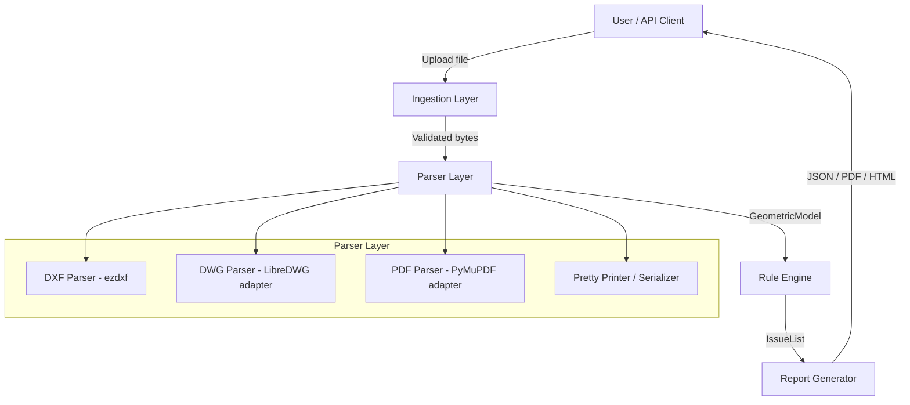

# Design Document

## Engineering Drawing Analyzer

---

## Overview

The Engineering Drawing Analyzer is a Python-based backend service that ingests engineering drawings in DXF, DWG, and PDF (vector) formats, parses them into a normalized internal Geometric Model, and runs a rule-based verification engine against that model to produce a structured Verification Report. The report identifies issues with dimension completeness, geometric constraints, tolerances, manufacturing readiness, and ANSI/ASME Y14.5 GD&T compliance, along with corrective action guidance.

The system is designed as a pipeline:

```
Input File → Parser → Geometric Model → Rule Engine → Issue List → Report Generator → Output
```

Key design goals:
- **Format abstraction**: All three input formats (DXF, DWG, PDF) are normalized into the same Geometric Model before any verification logic runs, so rules are written once.
- **Round-trip fidelity**: The Geometric Model can be serialized to JSON and re-parsed, producing an equivalent model — enabling testing, caching, and debugging.
- **Extensible rule engine**: Verification rules are registered independently and can be added, removed, or overridden without touching the core pipeline.
- **Deterministic output**: Given the same Geometric Model, the rule engine always produces the same set of issues.

---

## Architecture

The system is organized into five layers:



### Component Responsibilities

| Layer | Responsibility |
|---|---|
| Ingestion | File size validation, format detection, routing to correct parser |
| Parser | Format-specific reading; produces a `GeometricModel` |
| Pretty Printer | Serializes `GeometricModel` → JSON; deserializes JSON → `GeometricModel` |
| Rule Engine | Applies ordered verification rules; collects `Issue` objects |
| Report Generator | Renders `IssueList` into JSON, PDF, or HTML output |

---

## Components and Interfaces

### 2.1 Ingestion Layer

```python
class IngestionService:
    MAX_FILE_SIZE_BYTES: int = 100 * 1024 * 1024  # 100 MB

    def ingest(self, file_path: str) -> bytes:
        """
        Validates file size and detects format.
        Raises FileTooLargeError if size > 100 MB.
        Raises UnsupportedFormatError if format is not DXF/DWG/PDF.
        Returns raw bytes for the parser.
        """
        ...

    def detect_format(self, file_path: str) -> DrawingFormat:
        """Returns DrawingFormat.DXF | DWG | PDF based on magic bytes and extension."""
        ...
```

### 2.2 Parser Layer

Each parser implements the `DrawingParser` protocol:

```python
from typing import Protocol

class DrawingParser(Protocol):
    def parse(self, data: bytes, source_path: str) -> GeometricModel:
        """
        Parses raw bytes into a GeometricModel.
        Raises ParseError with location info on failure.
        """
        ...
```

**DXF Parser** — wraps `ezdxf` (MIT-licensed, actively maintained, supports DXF R12 through 2018):
- Iterates modelspace entities: `LINE`, `ARC`, `CIRCLE`, `LWPOLYLINE`, `DIMENSION`, `LEADER`, `TOLERANCE`, `INSERT` (blocks), `MTEXT`/`TEXT`
- Extracts dimension entities into `Dimension` objects with value, tolerance, and location
- Extracts `TOLERANCE` entities (GD&T feature control frames) into `FeatureControlFrame` objects
- Extracts `INSERT` entities referencing title block blocks into `TitleBlock`

**DWG Parser** — wraps LibreDWG via its C shared library through `ctypes`, or alternatively converts DWG → DXF using the `oda_file_converter` CLI (ODA File Converter, free for non-commercial use) and then delegates to the DXF parser. The conversion approach is preferred for reliability:
```
DWG file → oda_file_converter → DXF temp file → DXF Parser → GeometricModel
```

**PDF Parser** — wraps `PyMuPDF` (AGPL / commercial license):
- Extracts vector paths (lines, arcs, curves) from each page using `page.get_drawings()`
- Extracts text annotations using `page.get_text("dict")` to recover dimension text, GD&T symbols, and title block fields
- Heuristically associates text near geometry to form `Dimension` and `FeatureControlFrame` objects

### 2.3 Pretty Printer / Serializer

```python
class GeometricModelSerializer:
    def serialize(self, model: GeometricModel) -> dict:
        """Converts GeometricModel to a JSON-serializable dict."""
        ...

    def deserialize(self, data: dict) -> GeometricModel:
        """Reconstructs a GeometricModel from a previously serialized dict."""
        ...
```

The serialized format is a JSON object with a `schema_version` field to support future migrations. All geometry coordinates are stored as lists of floats. Enumerations are stored as their string names.

### 2.4 Rule Engine

```python
class RuleEngine:
    def __init__(self, rules: list[VerificationRule]):
        self._rules = rules

    def run(self, model: GeometricModel) -> list[Issue]:
        """
        Applies all registered rules in order.
        Returns the combined list of Issues.
        """
        issues: list[Issue] = []
        for rule in self._rules:
            issues.extend(rule.check(model))
        return issues

class VerificationRule(Protocol):
    @property
    def rule_id(self) -> str: ...

    def check(self, model: GeometricModel) -> list[Issue]:
        """Returns zero or more Issues found by this rule."""
        ...
```

Rules are grouped into modules and registered at startup:

| Module | Rules |
|---|---|
| `dimension_completeness` | Size dimension check, position dimension check, over-dimension check, angular dimension check |
| `geometric_constraints` | Datum reference frame check, feature orientation check, GD&T datum reference validity |
| `tolerance_verification` | Dimension tolerance check, feature control frame completeness, tolerance stack-up |
| `manufacturing_readiness` | Title block check, surface finish check, hole specification check, view sufficiency check, note contradiction check |
| `gdt_compliance` | Symbol set validation, composite FCF rules, datum feature symbol placement |

### 2.5 Report Generator

```python
class ReportGenerator:
    def generate(
        self,
        model: GeometricModel,
        issues: list[Issue],
        format: ReportFormat,
    ) -> bytes:
        """
        Renders the Verification Report.
        Raises UnsupportedReportFormatError for unknown formats.
        Supported: ReportFormat.JSON, ReportFormat.PDF, ReportFormat.HTML
        """
        ...
```

- **JSON**: Uses Python's `json` module; schema defined below in Data Models.
- **HTML**: Uses Jinja2 templates; self-contained single-file output with embedded CSS.
- **PDF**: Renders the HTML output through `WeasyPrint` (converts HTML/CSS → PDF without a browser dependency).

---

## Data Models

### Core Types

```python
from dataclasses import dataclass, field
from enum import Enum
from typing import Optional

class Severity(str, Enum):
    CRITICAL = "Critical"
    WARNING = "Warning"
    INFO = "Info"

class DrawingFormat(str, Enum):
    DXF = "DXF"
    DWG = "DWG"
    PDF = "PDF"

class ReportFormat(str, Enum):
    JSON = "JSON"
    PDF = "PDF"
    HTML = "HTML"

@dataclass
class Point2D:
    x: float
    y: float

@dataclass
class LocationReference:
    view_name: str                    # e.g. "FRONT", "SECTION A-A"
    coordinates: Optional[Point2D]   # drawing-space coordinates
    label: Optional[str]             # annotation label if available

@dataclass
class Tolerance:
    upper: float
    lower: float                      # negative for bilateral, 0 for unilateral
    is_general: bool = False          # True if inherited from title block

@dataclass
class Dimension:
    id: str
    value: float
    unit: str                         # "mm" | "in"
    tolerance: Optional[Tolerance]
    location: LocationReference
    associated_feature_ids: list[str] = field(default_factory=list)

@dataclass
class FeatureControlFrame:
    id: str
    gdt_symbol: str                   # e.g. "⊕" (position), "⊘" (flatness)
    tolerance_value: Optional[float]
    datum_references: list[str]       # e.g. ["A", "B", "C"]
    material_condition: Optional[str] # "MMC" | "LMC" | "RFS"
    location: LocationReference

@dataclass
class Datum:
    label: str                        # "A", "B", "C", etc.
    feature_id: str
    location: LocationReference

@dataclass
class Feature:
    id: str
    feature_type: str                 # "HOLE", "SLOT", "SURFACE", "EDGE", etc.
    dimensions: list[Dimension] = field(default_factory=list)
    feature_control_frames: list[FeatureControlFrame] = field(default_factory=list)
    location: Optional[LocationReference] = None
    is_angular: bool = False
    is_threaded: bool = False
    is_blind_hole: bool = False

@dataclass
class TitleBlock:
    part_number: Optional[str]
    revision: Optional[str]
    material: Optional[str]
    scale: Optional[str]
    units: Optional[str]

@dataclass
class View:
    name: str                         # "FRONT", "TOP", "RIGHT", "SECTION A-A", etc.
    features: list[str]               # feature IDs visible in this view

@dataclass
class GeometricModel:
    schema_version: str = "1.0"
    source_format: DrawingFormat = DrawingFormat.DXF
    features: list[Feature] = field(default_factory=list)
    dimensions: list[Dimension] = field(default_factory=list)
    datums: list[Datum] = field(default_factory=list)
    feature_control_frames: list[FeatureControlFrame] = field(default_factory=list)
    title_block: Optional[TitleBlock] = None
    views: list[View] = field(default_factory=list)
    general_tolerance: Optional[Tolerance] = None
    notes: list[str] = field(default_factory=list)
```

### Issue and Report Types

```python
@dataclass
class Issue:
    issue_id: str
    rule_id: str
    issue_type: str                   # e.g. "MISSING_SIZE_DIMENSION"
    severity: Severity
    description: str
    location: LocationReference
    corrective_action: Optional[str] = None
    standard_reference: Optional[str] = None  # e.g. "ASME Y14.5-2018 §7.2"

@dataclass
class VerificationReport:
    drawing_id: str
    analysis_timestamp: str           # ISO 8601
    overall_status: str               # "Pass" | "Fail"
    issue_counts: dict[str, int]      # {"Critical": N, "Warning": N, "Info": N}
    issues: list[Issue]
    systemic_patterns: list[str]      # summary notes for repeated issue types
```

### JSON Report Schema

```json
{
  "drawing_id": "string",
  "analysis_timestamp": "ISO8601",
  "overall_status": "Pass | Fail",
  "issue_counts": {
    "Critical": 0,
    "Warning": 0,
    "Info": 0
  },
  "issues": [
    {
      "issue_id": "string",
      "rule_id": "string",
      "issue_type": "string",
      "severity": "Critical | Warning | Info",
      "description": "string",
      "location": {
        "view_name": "string",
        "coordinates": {"x": 0.0, "y": 0.0},
        "label": "string"
      },
      "corrective_action": "string",
      "standard_reference": "string"
    }
  ],
  "systemic_patterns": ["string"]
}
```

---

## Correctness Properties

*A property is a characteristic or behavior that should hold true across all valid executions of a system — essentially, a formal statement about what the system should do. Properties serve as the bridge between human-readable specifications and machine-verifiable correctness guarantees.*

### Property 1: Geometric Model Round-Trip Fidelity

*For any* `GeometricModel` instance, serializing it to JSON with `GeometricModelSerializer.serialize()` and then deserializing the result with `GeometricModelSerializer.deserialize()` SHALL produce a `GeometricModel` that is structurally equivalent to the original — same features, dimensions, datums, tolerances, feature control frames, title block, views, and notes.

**Validates: Requirements 1.2, 1.5, 1.6**

---

### Property 2: Missing Required Dimension Produces Critical Issue

*For any* `GeometricModel` containing a `Feature` that lacks a required dimension (size dimension for any feature, position dimension for any feature, or angular dimension for any feature with `is_angular == True`), the rule engine SHALL produce at least one `Issue` with `severity == Severity.CRITICAL` whose location references that feature.

**Validates: Requirements 2.1, 2.2, 2.3, 2.4, 2.7, 2.8**

---

### Property 3: Over-Dimension Detection Produces Warning

*For any* `GeometricModel` in which a `Feature` has two or more `Dimension` objects that specify the same geometric property (conflicting dimensions), the rule engine SHALL produce at least one `Issue` with `severity == Severity.WARNING` referencing those conflicting dimensions.

**Validates: Requirements 2.5, 2.6**

---

### Property 4: Missing Tolerance Produces Critical Issue

*For any* `GeometricModel` that has `general_tolerance == None` and contains at least one `Dimension` with `tolerance == None`, the rule engine SHALL produce at least one `Issue` with `severity == Severity.CRITICAL` for each such untolerated dimension.

**Validates: Requirements 4.1, 4.2**

---

### Property 5: Issue List Completeness

*For any* `GeometricModel`, every feature, dimension, or annotation that violates a Critical-severity rule SHALL appear in at least one `Issue` in the returned issue list. Conversely, no element that satisfies all applicable rules SHALL appear in a Critical-severity `Issue`.

**Validates: Requirements 2.2, 2.4, 2.8, 3.2, 3.5, 3.7, 4.2, 4.4, 5.2, 5.6, 5.8, 5.10**

---

### Property 6: Report JSON Schema Validity

*For any* `VerificationReport`, serializing it to JSON SHALL produce a document that satisfies the defined JSON report schema: all required fields are present with correct types, `overall_status` is exactly `"Pass"` or `"Fail"`, and the counts in `issue_counts` match the actual count of `Issue` objects per severity level.

**Validates: Requirements 6.1, 6.2, 6.4**

---

### Property 7: Pass Status If and Only If Zero Issues

*For any* `VerificationReport`, `overall_status == "Pass"` if and only if `len(issues) == 0`.

**Validates: Requirements 6.1, 6.3**

---

### Property 8: Systemic Pattern Detection Threshold

*For any* `GeometricModel` that causes the rule engine to produce more than three `Issue` objects sharing the same `issue_type`, the resulting `VerificationReport` SHALL contain at least one entry in `systemic_patterns` that references that issue type.

**Validates: Requirements 8.3**

---

### Property 9: Non-Standard GD&T Symbol Produces Warning

*For any* `FeatureControlFrame` whose `gdt_symbol` value is not a member of the ANSI/ASME Y14.5-2018 standard symbol set, the rule engine SHALL produce at least one `Issue` with `severity == Severity.WARNING` identifying that symbol and its location.

**Validates: Requirements 7.1, 7.2**

---

### Property 10: Critical Issues Always Carry Corrective Action and Standard Reference

*For any* `Issue` with `severity == Severity.CRITICAL`, the `corrective_action` field SHALL be non-null and non-empty. For any Critical `Issue` related to a GD&T or drawing standard rule, the `standard_reference` field SHALL also be non-null and reference the applicable ANSI/ASME Y14.5 clause.

**Validates: Requirements 8.1, 8.2**

---

### Property 11: Title Block Missing Fields Produce One Critical Issue Per Field

*For any* `GeometricModel` whose `title_block` is missing one or more of the required fields (part number, revision, material, scale, units), the rule engine SHALL produce exactly one `Issue` with `severity == Severity.CRITICAL` for each missing field — no more, no fewer.

**Validates: Requirements 5.1, 5.2**

---

### Property 12: Tolerance Stack-Up Violation Produces Warning

*For any* `GeometricModel` containing a dimension chain where the arithmetic sum of individual tolerances exceeds the tightest (smallest) tolerance in that chain, the rule engine SHALL produce at least one `Issue` with `severity == Severity.WARNING` that includes the calculated stack-up value in its description.

**Validates: Requirements 4.5, 4.6**

---

### Property 13: Unsupported Report Format Raises Error with Supported List

*For any* format string that is not one of `{"JSON", "PDF", "HTML"}`, requesting a report in that format SHALL raise an `UnsupportedReportFormatError` whose message includes the requested format and lists all supported formats.

**Validates: Requirements 6.5**

---

## Error Handling

### Parse Errors

```python
class ParseError(Exception):
    def __init__(self, message: str, file_format: str, byte_offset: Optional[int] = None):
        ...

class FileTooLargeError(Exception):
    def __init__(self, actual_size_bytes: int, limit_bytes: int):
        ...

class UnsupportedFormatError(Exception):
    def __init__(self, detected_format: str, supported_formats: list[str]):
        ...

class UnsupportedReportFormatError(Exception):
    def __init__(self, requested_format: str, supported_formats: list[str]):
        ...
```

### Error Handling Strategy

| Scenario | Behavior |
|---|---|
| File > 100 MB | Raise `FileTooLargeError` before reading content; return HTTP 413 at API layer |
| Unrecognized format | Raise `UnsupportedFormatError` with supported list |
| Corrupted DXF/DWG | `ezdxf.recover` attempts structural repair; if unrecoverable, raise `ParseError` with byte offset |
| Corrupted PDF | PyMuPDF returns partial content; parser raises `ParseError` with page number |
| DWG conversion failure | Log ODA converter stderr; raise `ParseError` with converter exit code |
| Rule engine exception | Catch per-rule; log with rule ID; continue with remaining rules; append an `INFO` issue noting the rule failure |
| Report format unsupported | Raise `UnsupportedReportFormatError` listing JSON, PDF, HTML |
| Analysis timeout (>60s) | Return partial report with a `WARNING` issue noting incomplete analysis |

### Logging

All errors are logged with structured JSON fields: `timestamp`, `level`, `component`, `drawing_id`, `error_type`, `message`. No raw file content is logged to avoid leaking sensitive design data.

---

## Testing Strategy

### Dual Testing Approach

The system uses both example-based unit tests and property-based tests (via **Hypothesis**, the standard Python PBT library).

**Unit tests** cover:
- Specific parsing examples for each format (DXF, DWG, PDF)
- Known GD&T symbol sets (valid and invalid symbols)
- Title block field extraction with concrete fixtures
- Report generation output structure
- Error conditions (corrupted files, oversized files, unsupported formats)

**Property-based tests** (Hypothesis, minimum 100 iterations each) cover the correctness properties defined above. Each test is tagged with a comment referencing its design property:

```python
# Feature: engineering-drawing-analyzer, Property 1: Geometric Model Round-Trip Fidelity
@given(st.from_type(GeometricModel))
@settings(max_examples=100)
def test_round_trip_fidelity(model: GeometricModel):
    serializer = GeometricModelSerializer()
    serialized = serializer.serialize(model)
    restored = serializer.deserialize(serialized)
    assert models_equivalent(model, restored)
```

### Test Organization

```
tests/
  unit/
    test_dxf_parser.py
    test_dwg_parser.py
    test_pdf_parser.py
    test_serializer.py
    test_rule_dimension_completeness.py
    test_rule_geometric_constraints.py
    test_rule_tolerance_verification.py
    test_rule_manufacturing_readiness.py
    test_rule_gdt_compliance.py
    test_report_generator.py
  property/
    test_round_trip.py          # Property 1
    test_issue_severity.py      # Properties 2, 3, 4, 5
    test_report_schema.py       # Properties 6, 7
    test_systemic_patterns.py   # Property 8
    test_gdt_symbols.py         # Property 9
    test_corrective_actions.py  # Property 10
  fixtures/
    sample_drawings/            # DXF, DWG, PDF test files
    expected_reports/           # Golden JSON reports for regression
```

### Property Test Configuration

Hypothesis strategies for `GeometricModel` generation:
- `st.builds(Feature, ...)` with varying numbers of dimensions (0 to 20)
- `st.builds(Dimension, ...)` with random float values and optional tolerances
- `st.builds(FeatureControlFrame, ...)` with both valid and invalid GD&T symbols
- `st.builds(TitleBlock, ...)` with randomly missing fields

### Performance Testing

The 60-second SLA (Requirement 6.6) is validated with a benchmark test against a synthetic drawing with exactly 500 features, run in CI using `pytest-benchmark`.

### Integration Testing

- End-to-end tests parse real DXF sample files (from the `ezdxf` test suite) through the full pipeline and assert report structure.
- DWG integration tests use a small set of checked-in DWG fixtures converted via ODA File Converter in CI.
- PDF integration tests use vector PDFs exported from a CAD tool.
